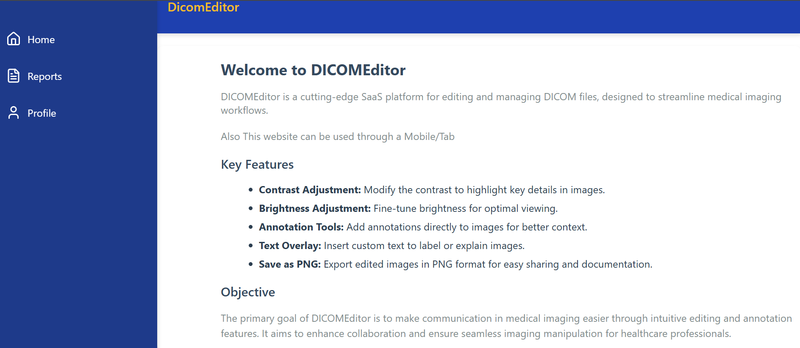

# DICOM Editor

A React.js-based project for editing and managing DICOM files. This project is designed to run in a Dockerized environment/Locally  for consistency and portability.

## Features
- Modern React.js setup using Node.js.
- Docker support for easy deployment.
- Quick setup and seamless local development experience.

## Prerequisites
Before you begin, ensure you have the following installed:
- Node.js (v13.12.0 or higher)
- Docker

## Project Structure
```
/app
  ├── src/                
  ├── public/             
  ├── package.json        
  └── Dockerfile
```


## Installation

### Clone the Repository
```bash
git clone https://github.com/SrujanRaghavendraS/Eddic.git
cd dicomeditor
```

### Install the dependencies
Use the command to Install the required dependencies 
`npm install`

### Start the server
Use the command after Installing all the dependencies 
`npm start`

### Use the service
Now go to the below link and start Exploring
`http://localhost:3000`

## Docker Image

### You can also use the docker Image from the dockerHub and start using it

### Pull the DockerImage
`docker pull srujanraghavendras/dicomeditor:dev`

### Run the DockerImage
You can run the dockerImage using the command below
`docker run -it -p 3000:3000 srujanraghavendras/dicomeditor:dev`

You can start using the SaaS by going to:
`http://localhost:3000`

## Troubleshoots
If the application doesn't start, ensure that all dependencies are installed and no other process is using port 3000.

For Docker-related issues, verify Docker is running and the image is correctly pulled.


# Usage
The Landing Page consists of HeroSection,FeatureSection and FooterSection which looks like the below images


Once You click on the Start Button You can see the below Screen

### Dashboard


### Reports


You can either Choose to edit the available `.dcm` image or You can choose from the File explorer


Once you select some file You can view the edit Panel as below


At Last The profile Section to contact me 


